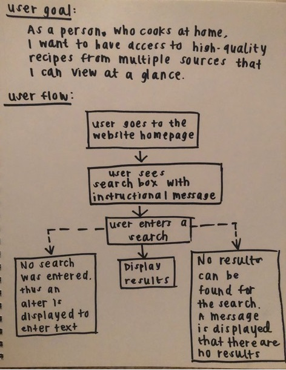

## About :peach: :ramen: :fork_and_knife: :cherries: :pizza: :green_apple:
This app allows users to search for food recipes. 
  

## Technologies
This app was created using React with Hooks. 
It gets recipe information from the Edamam Food Recipes API.
  

#### Why React?
Each recipe card has the same general structure. React makes it easy to predefine a structure and only worry about passing the necessary information to each card. 

#### Why Hooks?
This application uses hooks to handle the state of various elements in the application such as the user's dynamic search input, the finished query, and the returned set of recipes.
  

## Design
#### User Story
As a person who cooks at home, I want to have access to high-quality recipes from multiple sources so that I can view at a glance.
  

## :star: Demo :star:
To view this app live, visit https://strangeforloop.github.io/react-recipe-app/.
